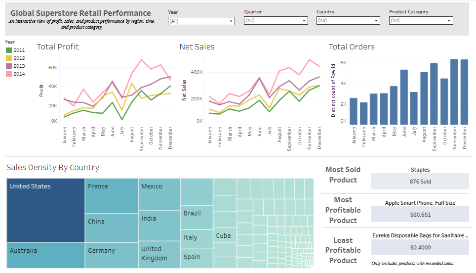

# Global Superstore Retail Performance Dashboard

This project showcases an interactive Tableau dashboard analyzing international retail performance using the Global Superstore Dataset from Kaggle. It includes data cleaning, transformation, and visualization steps.

## Dashboard Overview
The dashboard provides:
- Key metrics (Profit, Sales, Orders)
- Trend analysis over time (Yearly & Quarterly)
- Geographic sales density
- Interactive filters: Year & Quarter, as well as by Country & Product Category

This dashboard enables stakeholders to:
- Identify high-performing and underperforming products by product category & region.
- Track sales and profit trends over time.
- Visualize geographic sales density. 

## Project Files
- **`cleaned_superstore_data.ipynb`** – Step by step data cleaning and preparation using SQL in BigQuery.
- **`cleaned_superstore_data.csv`** – Exported clean dataset used in Tableau.
- **`Global_Superstore_Dashboard.twbx`** – Dashboard Tableau workbook file.
- **`Global_Superstore_Dashboard_Preview.PNG`** – Preview of the final dashboard.

Tools & Technologies
- **Tableau** – Data visualization and dashboarding  
- **Google BigQuery (SQL)** – Data cleaning and transformation  
- **Python (Google Collab Notebook)** – Documentation and data export  

## Key Features
- Interactive filters to look further into regions, product categories, and time periods  
- Dynamic product ranking logic using table calculations (RANK)  
- Data cleaning pipeline using SQL in BigQuery  

## How to Use
1. Open `cleaned_superstore_data.ipynb` to review the data cleaning steps.
2. Explore `cleaned_superstore_data.csv` for the cleaned dataset.
3. Open `Global_Superstore_Dashboard.twbx` in Tableau Desktop to interact with the dashboard or visit the [Live Dashboard on Tableau Public](https://public.tableau.com/views/Global_Superstore_Dashboard_17536666482470/Dashboard1?:language=en-US&publish=yes&:sid=&:redirect=auth&:display_count=n&:origin=viz_share_link).

